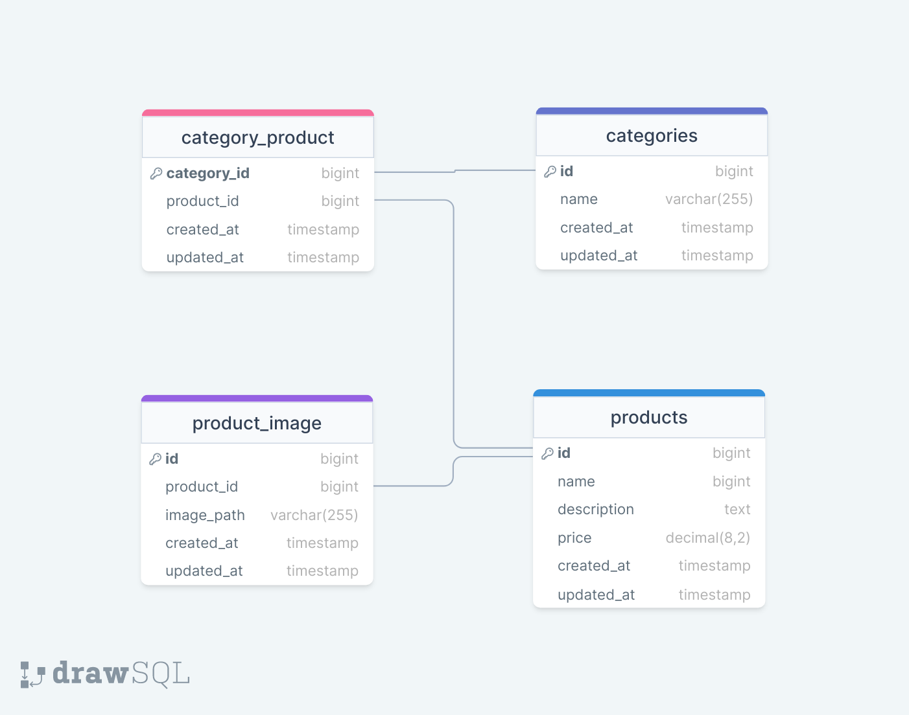

## Umbrella Api
#### Author: Saba Dumbadze

#

## Table of Contents

* [Prerequisites](#prerequisites)
* [Tech Stack](#tech-stack)
* [Getting Started](#getting-started)
* [Configuration](#configuration)
* [Development](#development)
* [Database Structure](#database-structure)

#

## Prerequisites

* _PHP@8.2 and up_
* _composer@2.4 and up_
* _MYSQL@8 and up_

#

## Tech Stack

-   [Laravel](https://laravel.com/)

#

## Getting Started

1. Clone the repository from GitHub:
    ```shell
      git clone https://github.com/dumba23/umbrella-api.git
      cd umbrella-api
    ```
2. Install PHP dependencies:
    ```shell
      composer install
    ```
3. Copy the `.env` file:
    ```shell
      cp .env.example .env
    ```
4. Generate a new application key:
    ```shell
      php artisan key:generate
    ```

#

## Configuration

1. Modify the database configuration in your `.env` file. DB_PASSWORD is empty by default.
   > DB_CONNECTION=mysql <br>
   DB_HOST=127.0.0.1 <br>
   DB_PORT=3306 <br>
   DB_DATABASE=umbrella_api <br>
   DB_USERNAME=<your_username> <br>
   DB_PASSWORD=<your_password> <br>
2. Run database migrations:

```shell
    php artisan migrate
```

3. Link storage to public:

```shell
    php artisan storage:link
```

4. Run the product seeder

```shell
    php artisan db:seed --class=ProductSeeder
```

#

## Development

You need to start Laravel servers:

```shell
    php artisan serve
```

## Database Design Diagram



#
